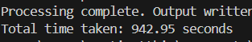

# 50 samples
### CoT Prompt

- ~1100 seconds
- ~1000 seconds

### Normal Prompt

- ~820 seconds
- ~900 seconds

### CoT Prompt with batching (Send multiple log lines in each request) (10 samples each)
- Better Accuracy than Normal Prompt

- ~970 seconds

### CoT Prompt with batching (multiple log lines in one prompt)
- Lower accuracy and shouldn't be use.
