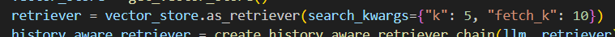
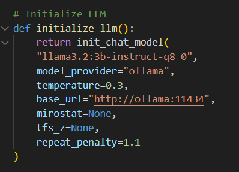
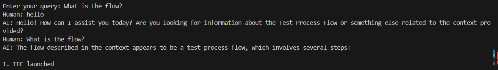

# Conversational RAG Chatbot API

This project is a FastAPI-based Conversational Retrieval-Augmented Generation (RAG) system that answers user questions based on web documents. It uses LangChain, HuggingFace sentence embeddings, and FAISS vector storage.

# Features:

Conversational memory using LangChain's ChatMessageHistory

Local document loading and semantic chunking

Contextual retriever with history-aware reformulation

RAG pipeline with concise and professional answers

Stateless API with UUID-based sessions

## **Important**
1. Having better GPU and optimizing the pipeline is recommended.
2. Change fetchK to increase the amount of chunks being pulled from documents and change k to choose how many of them will be used.


3. Change model here



4. Add the documents to the `data` folder and use `/embed` endpoint to re-embed

# Installation (How to use)

1. Install uv package manager (https://github.com/astral-sh/uv)
```bash
# With pip.
pip install uv
```

2. Clone this repository `git clone <repository_url>`

3. `cd` into the project directory (solution_finding)

## Environment Setup

- Create .env file in your project directory and put in:

```
LANGSMITH_TRACING=true
LANGSMITH_API_KEY=your_langsmith_key (https://docs.smith.langchain.com/administration/how_to_guides/organization_management/create_account_api_key)
LANGCHAIN_PROJECT=your_project_name
```

## First time (One time) setup

1. Download Ollama
  - On windows
    - https://ollama.com/download/windows
    - install
  - On Linux
    - `curl -fsSL https://ollama.com/install.sh | sh`

2. Download model in any terminal using command line
  - `ollama run llama3.2:3b-instruct-q8_0`

3. `uv venv`

4. `source venv/bin/activate` # On Windows: `.venv\Scripts\activate`

5. `uv sync` or `uv pip install -r requirements.txt`

## Otherwise

1. `source venv/bin/activate` # On Windows: `.venv\Scripts\activate`


# Run the API

`uvicorn llm_rag_api:app --reload --port 8001`

# API Endpoints

| **Endpoint**          | **Method** | **Description**                                                                                  | **Request Body**                                                                                 | **Response**                                                                                       |
|-----------------------|------------|--------------------------------------------------------------------------------------------------|---------------------------------------------------------------------------------------------------|---------------------------------------------------------------------------------------------------|
| `/`                   | `GET`      | Welcome endpoint. Verifies that the API is running.                                              | None                                                                                              | `{"message": "Welcome to the Conversational PDF RAG API! Visit /docs for API documentation."}`    |
| `/session`            | `POST`     | Creates a new session and returns a unique session ID.                                           | None                                                                                              | `{"conversation_id": "<unique_conversation_id>"}`                                                           |
| `/embed`              | `POST`     | Re-embeds the document data forcefully by reprocessing the PDFs in the folder.                   | None                                                                                              | `{"message": "Data has been re-embedded successfully."}`                                          |
| `/query`              | `POST`     | Queries the chatbot for a specific session and retrieves a response based on the conversation.   | `{"conversation_id": "<conversation_id>", "query": "<user_query>"}`                                         | `{"answer": "<response_from_bot>"}`                                                               |

# How It Works (Simplified)

Lifespan Initialization

During application startup:

.env variables are loaded.,

The LLM (llama3.2:3b-instruct-q8_0) is initialized using Ollama.,

Sentence-transformer embeddings (all-MiniLM-L6-v2) are loaded.,

Content from pdf files are parsed and chunked, Vector store is populated with document chunks. Unless it exist, it will just load the existing files.,

A retriever and RAG chain are wrapped in a memory-enabled RunnableWithMessageHistory.,

## Internals:

Reformulates the query using chat history.

Retrieves relevant chunks via vector search.

Uses a prompt + context to generate concise answers.

# Function Overview

| **Function**                        | **Description**                                                                 | **Input**               | **Output**                          |
|-------------------------------------|---------------------------------------------------------------------------------|-------------------------|--------------------------------------|
| `load_environment_variables()`      | Loads environment variables from a `.env` file                                  | -                       | Sets environment variables          |
| `initialize_llm()`                  | Creates a chat-based LLM instance                                               | -                       | LLM instance                        |
| `initialize_embeddings_and_store()` | Loads sentence transformer embeddings and sets up a vector store                | -                       | Vector store                        |
| `load_documents_from_pdfs(folder_path)` | Loads PDFs from the specified folder path using `PyMuPDFLoader`                | `folder_path`           | List of Documents                   |
| `split_documents(docs)`             | Splits documents into overlapping chunks                                        | `docs`                  | List of chunks                      |
| `create_history_aware_retriever_chain(llm, retriever)` | Builds a retriever that reformulates queries based on conversation history     | `llm`, `retriever`      | Chain                               |
| `create_rag_chain(llm, retriever)`  | Creates the final RAG (Retrieval-Augmented Generation) pipeline                 | `llm`, `retriever`      | Chain                               |
| `get_conversation_history(conversation_id)` | Retrieves or creates a chat message history for a session                      | `conversation_id`   | ChatMessageHistory (AI and Human)                 |
| `initialize_conversational_chain(rag_chain, conversation_history_store)` | Wraps the RAG chain with a history-aware interface                              | `rag_chain`, `conversation_history_store`    | RunnableWithMessageHistory          |
| `generate_uuid_conversation_id()`        | Generates a secure random UUID for session management                           | -                       | UUID string                         |

# Example Images

ChatMessageHistory:



# Tech Stack

FastAPI – Web server

LangChain – Chain orchestration

Ollama – Local LLM provider

PyMuPDF – PDF files loader

Sentence Transformers – Semantic embeddings

# Notes

- Ollama model will stop by itself when not used for 5 minutes, but it can also be restarted automatically upon querying
- Files need to be run using command line in the venv which should be the same name as directory name or run with `uv run` then use commands normally. 